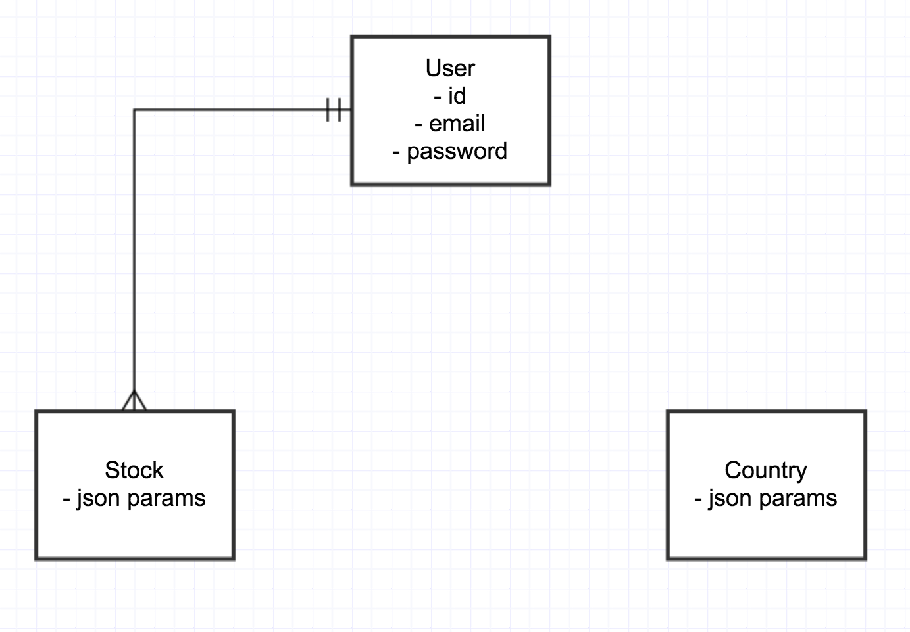

# [Mapitalist](http://www.mapitalist.com):
## Mapitalist allows you to see how the world stock markets change on a daily basis. Each country is tracked through an index funds or ETF that represents its entire stock market.

## Technologies:
- Yahoo Finance API
- Twitter API
- and Google Maps API
- Javascript
- and Ruby on Rails.

## Instructions:
- Click on a country of interest to see specific details. Use the left side navigation menu for more options. 
  - Click the globe to see a world summary
  - Click the globe for country specific detail
  - Click on the graph ...
  - Click on the chatter icon to see recent tweets referencing the index used to track that specific country

## Setup:
- Run `bundle install`
- Run `rake db:setup`
- Run `rails s`
- Navigate to your page (e.g. localhost:3000)
- Enjoy!

## ERD:
